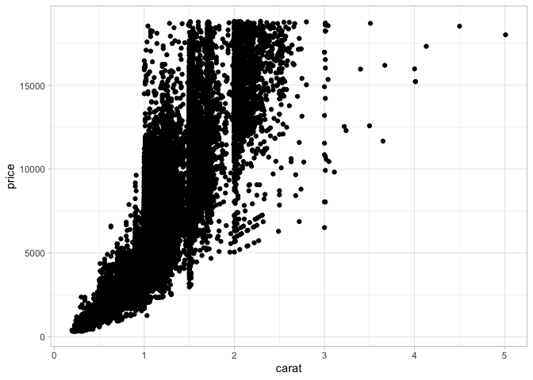
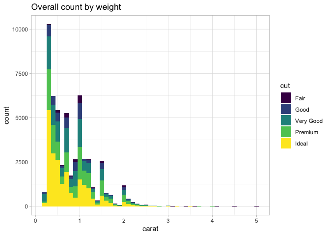
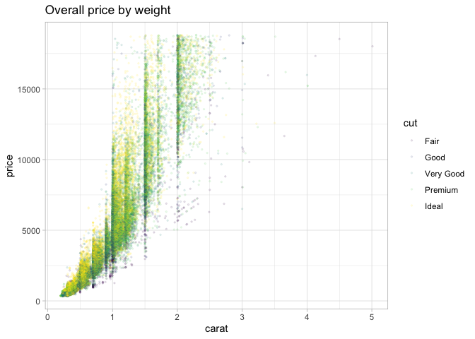
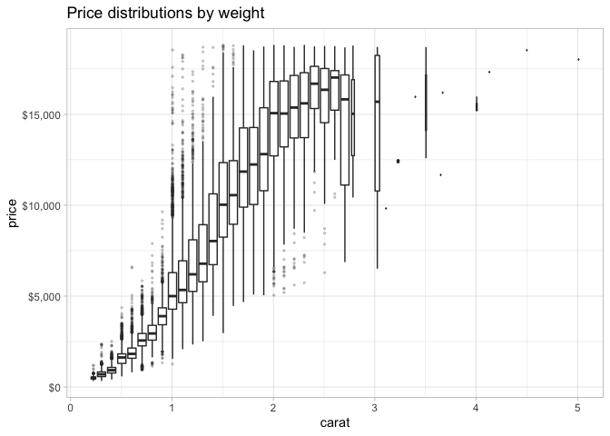
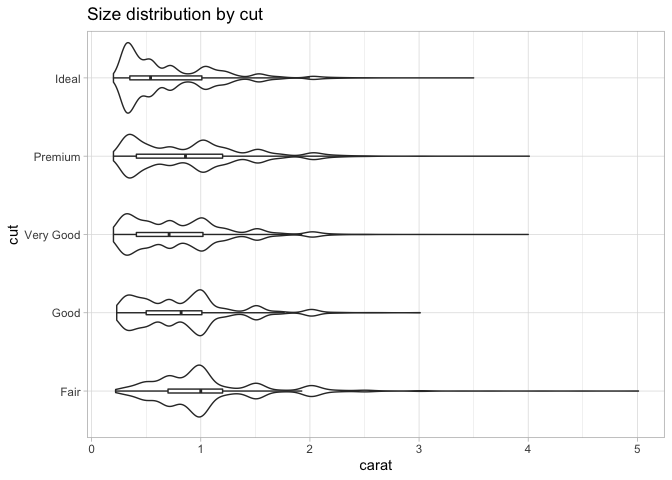
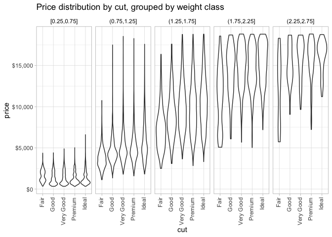

Getting Started: Diamonds
================
Roland Crosby
2020-07-10

  - [Grading Rubric](#grading-rubric)
      - [Individual](#individual)
      - [Team](#team)
      - [Due Date](#due-date)
  - [Data Exploration](#data-exploration)
  - [Communication](#communication)

*Purpose*: Throughout this course, you’ll complete a large number of
*exercises* and *challenges*. Exercises are meant to introduce content
with easy-to-solve problems, while challenges are meant to make you
think more deeply about and apply the content. The challenges will start
out highly-scaffolded, and become progressively open-ended.

In this challenge, you will go through the process of exploring,
documenting, and sharing an analysis of a dataset. We will use these
skills again and again in each challenge.

<!-- include-rubric -->

# Grading Rubric

<!-- -------------------------------------------------- -->

Unlike exercises, **challenges will be graded**. The following rubrics
define how you will be graded, both on an individual and team basis.

## Individual

<!-- ------------------------- -->

| Category    | Unsatisfactory                                                                   | Satisfactory                                                               |
| ----------- | -------------------------------------------------------------------------------- | -------------------------------------------------------------------------- |
| Effort      | Some task **q**’s left unattempted                                               | All task **q**’s attempted                                                 |
| Observed    | Did not document observations                                                    | Documented observations based on analysis                                  |
| Supported   | Some observations not supported by analysis                                      | All observations supported by analysis (table, graph, etc.)                |
| Code Styled | Violations of the [style guide](https://style.tidyverse.org/) hinder readability | Code sufficiently close to the [style guide](https://style.tidyverse.org/) |

## Team

<!-- ------------------------- -->

| Category   | Unsatisfactory                                                                                   | Satisfactory                                       |
| ---------- | ------------------------------------------------------------------------------------------------ | -------------------------------------------------- |
| Documented | No team contributions to Wiki                                                                    | Team contributed to Wiki                           |
| Referenced | No team references in Wiki                                                                       | At least one reference in Wiki to member report(s) |
| Relevant   | References unrelated to assertion, or difficult to find related analysis based on reference text | Reference text clearly points to relevant analysis |

## Due Date

<!-- ------------------------- -->

All the deliverables stated in the rubrics above are due on the day of
the class discussion of that exercise. See the
[Syllabus](https://docs.google.com/document/d/1jJTh2DH8nVJd2eyMMoyNGroReo0BKcJrz1eONi3rPSc/edit?usp=sharing)
for more information.

# Data Exploration

<!-- -------------------------------------------------- -->

In this first stage, you will explore the `diamonds` dataset and
document your observations.

**q1** Create a plot of `price` vs `carat` of the `diamonds` dataset
below. Document your observations from the visual.

*Hint*: We learned how to do this in `e-vis00-basics`\!

``` r
diamonds %>%
  ggplot() +
  theme_light() +
  geom_point(aes(x = carat, y = price))
```

<!-- -->

**Observations**:

  - Larger diamonds appear more expensive then smaller diamonds.
  - While `carat` is a continuous variable, many observations appear to
    cluster just above integer carat numbers.
      - maybe a 1.9 carat diamond is significantly less desirable than a
        2 carat diamond?
  - There is a great deal of variance among diamonds of the same carat
    size.

**q2** Create a visualization showing variables `carat`, `price`, and
`cut` simultaneously. Experiment with which variable you assign to which
aesthetic (`x`, `y`, etc.) to find an effective visual.

``` r
diamonds %>% 
  ggplot(aes(x = carat, fill = cut)) +
  geom_histogram(binwidth = 0.1, position = "stack") +
  theme_light() +
  ggtitle("Overall count by weight")
```

<!-- -->

``` r
diamonds %>%
  ggplot(aes(x = carat, y = price)) +
  geom_point(aes(color = cut), size=0.5, alpha=0.1) +
  theme_light() +
  ggtitle("Overall price by weight")
```

<!-- -->

``` r
# after making the first version of this i found a very similar plot in the docs:
# https://ggplot2.tidyverse.org/reference/geom_boxplot.html
diamonds %>%
  transform(chunk = cut_width(carat, 0.1)) %>%
  ggplot(aes(x = carat, y = price)) +
  geom_boxplot(aes(group = chunk), outlier.alpha = 0.2, outlier.size = 0.5) +
  scale_y_continuous(labels = scales::dollar) +
  theme_light() +
  ggtitle("Price distributions by weight")
```

<!-- -->

``` r
diamonds %>%
  ggplot(aes(x = cut, y = carat)) +
  geom_violin() +
  geom_boxplot(width = 0.05, outlier.shape = NA, fill = NA) +
  theme_light() +
  coord_flip() +
  ggtitle("Size distribution by cut")
```

<!-- -->

``` r
diamonds %>%
  filter(carat >= 0.25 & carat <= 2.75) %>% 
  transform(chunk = cut_width(carat, width = 0.5)) %>%
  ggplot(aes(x = cut, y = price)) +
  facet_grid(cols = vars(chunk)) +
  geom_violin() +
  # geom_boxplot(outlier.shape = NA) +
  # geom_jitter(width = 0.2, size = 0.1, alpha = 0.1) +
  scale_y_continuous(labels = scales::dollar) +
  theme_light() +
  theme(axis.text.x = element_text(angle = 90, hjust = 1, vjust = 0.3)) +
  theme(strip.background = element_rect(fill = NA))+
  theme(strip.text = element_text(colour = "black")) +
  ggtitle("Price distribution by cut, grouped by weight class")
```

<!-- -->

**Observations**:

  - The vast majority of diamonds in the dataset are between 0.25 and
    2.5 carats.
      - It’s hard to understand intuitively what to make of the data for
        diamonds outside of that range.
  - Diamond weights in the dataset cluster just above round carat and
    half-carat values.
  - Within a band of weights, price seems to increase with cut quality.
  - Ideal diamonds have the lowest median weight.
  - All the largest diamonds have the lowest quality cut.

# Communication

<!-- -------------------------------------------------- -->

In this next stage, you will render your data exploration, push it to
GitHub to share with others, and link your observations within our [Data
Science
Wiki](https://olin-data-science.fandom.com/wiki/Olin_Data_Science_Wiki).

**q3** *Knit* your document in order to create a report.

You can do this by clicking the “Knit” button at the top of your
document in RStudio.

<!--  -->

This will create a local `.md` file, and RStudio will automatically open
a preview window so you can view your knitted document.

**q4** *Push* your knitted document to GitHub.

<!--  -->

You will need to stage both the `.md` file, as well as the `_files`
folder. Note that the `_files` folder, when staged, will expand to
include all the files under that directory.

<!--  -->

**q5** *Document* your findings in our
[Wiki](https://olin-data-science.fandom.com/wiki/Olin_Data_Science_Wiki).
Work with your learning team to come to consensus on your findings.

The [Datasets](https://olin-data-science.fandom.com/wiki/Datasets) page
contains lists all the datasets we’ve analyzed together.

**q6** *Prepare* to present your team’s findings\!

**q7** Add a link to your personal data-science repository on the
[Repositories](https://olin-data-science.fandom.com/wiki/Repositories)
page. Make sure to file it under your team name\!
